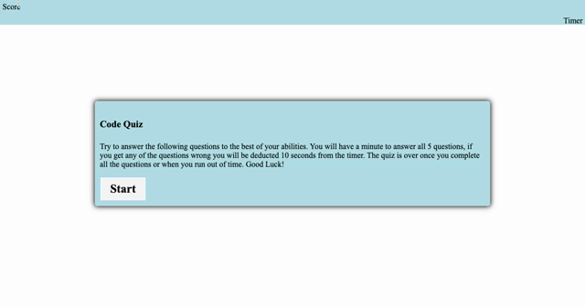

This is a timed quiz in which the user will have a minute to answer 5 multiple-choice questions. The timer starts when the user clicks start, as the user progresses through the quiz they are alerted if they got the questions correct or wrong. If the user got a question wrong then 10 seconds are deducted from the timer. Once the user finishes the quiz or the timer hits zero, they are directed to submit their initials and once the user hits enter their initials and score, which appears in the top left corner are added to the high scores list below the input box. Scores are stored until the clear button is clicked.

Link: 

Below is a gif of the the whole quiz in action:

